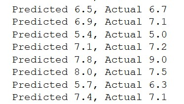

# Predicting Grades
* This project focuses on predicting grades of a student, given his/her past academic performance
* Alternative grading solution incase of exam cancellation
* The dataset was downloaded from Delhi Technological University's official website, and converted to a csv file using this [online tool](https://www.zamzar.com/)
* Using Sklearn library and a variety of Machine Learning Algorithms, with Random Forest Classifier performing the best.
* Final model was finally able to achieve an R2 score of ``0.701``!

# Sample Predictions

_____________________________
